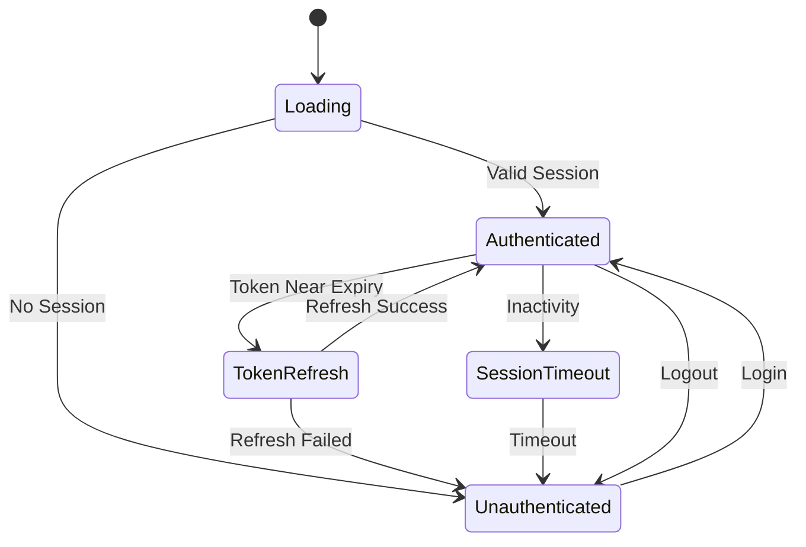

# Design Document

## Overview

Bu tasarım, mevcut authentication sisteminde session management ve token handling'i Amplify Auth'un gelişmiş özelliklerini kullanarak geliştirmeyi amaçlar. Mevcut middleware'deki basit cookie kontrolü yerine, Amplify'ın getCurrentUser API'si, session state management ve otomatik token yenileme özelliklerini kullanarak daha güvenli ve kullanıcı dostu bir sistem oluşturacak.

## Architecture

### Current Architecture
- **Session Check**: Middleware'de manuel cookie parsing
- **State Management**: Local component state
- **Token Handling**: Manuel cookie kontrolü
- **SSR Support**: Sınırlı hydration handling
- **Error Handling**: Basit error catching

### New Architecture
- **Session Check**: Amplify getCurrentUser API
- **State Management**: React Context + Amplify Auth state
- **Token Handling**: Amplify otomatik token yenileme
- **SSR Support**: Server-client state synchronization
- **Error Handling**: Comprehensive error boundaries ve fallbacks

## Components and Interfaces

### 1. AuthContext Provider
```typescript
interface AuthContextType {
  user: AuthUser | null;
  isLoading: boolean;
  isAuthenticated: boolean;
  signIn: (email: string, password: string) => Promise<SignInResult>;
  signOut: () => Promise<void>;
  refreshSession: () => Promise<void>;
}

interface AuthUser {
  userId: string;
  username: string;
  email: string;
  attributes: Record<string, string>;
  signInDetails?: SignInDetails;
}
```

### 2. Session Management Hook
```typescript
interface UseAuthReturn {
  user: AuthUser | null;
  isLoading: boolean;
  isAuthenticated: boolean;
  error: Error | null;
  signIn: (email: string, password: string) => Promise<SignInResult>;
  signOut: () => Promise<void>;
  refreshSession: () => Promise<void>;
}

const useAuth = (): UseAuthReturn;
```

### 3. Enhanced Middleware
```typescript
interface MiddlewareConfig {
  protectedRoutes: string[];
  publicRoutes: string[];
  authRoutes: string[];
  redirectAfterAuth: string;
  redirectAfterSignOut: string;
}

interface SessionCheckResult {
  isAuthenticated: boolean;
  user: AuthUser | null;
  needsRedirect: boolean;
  redirectTo?: string;
}
```

### 4. Session Timeout Manager
```typescript
interface SessionTimeoutConfig {
  warningTime: number; // minutes before timeout
  timeoutTime: number; // total session timeout
  checkInterval: number; // check interval in seconds
}

interface SessionTimeoutState {
  isActive: boolean;
  timeRemaining: number;
  showWarning: boolean;
}
```

## Data Models

### Auth State
```typescript
type AuthState = {
  user: AuthUser | null;
  isLoading: boolean;
  isAuthenticated: boolean;
  error: Error | null;
  sessionTimeout: SessionTimeoutState;
  lastActivity: Date;
}
```

### Session Storage
```typescript
interface SessionData {
  user: AuthUser;
  lastActivity: string;
  expiresAt: string;
  refreshToken?: string;
}
```

## Error Handling

### Authentication Errors
- **Token Expired**: Otomatik refresh attempt
- **Refresh Failed**: Redirect to login
- **Network Errors**: Retry mechanism
- **Invalid Session**: Clear state and redirect

### Session Management Errors
- **Timeout Errors**: Graceful logout
- **Sync Errors**: Client state priority
- **Hydration Errors**: Fallback to loading state

### Error Boundaries
```typescript
interface AuthErrorBoundaryState {
  hasError: boolean;
  error: Error | null;
  errorInfo: ErrorInfo | null;
}
```

## Testing Strategy

### Unit Tests
- **AuthContext**: State management testing
- **useAuth hook**: Hook behavior testing
- **Session utilities**: Utility function testing
- **Error handling**: Error scenario testing

### Integration Tests
- **Middleware integration**: Route protection testing
- **SSR compatibility**: Server-client sync testing
- **Token refresh**: Automatic refresh testing
- **Timeout handling**: Session timeout testing

### E2E Tests
- **Login flow**: Complete authentication flow
- **Session persistence**: Cross-tab session sync
- **Timeout scenarios**: Session timeout behavior
- **Error recovery**: Error state recovery

## Implementation Details

### Dependencies
Mevcut dependencies yeterli:
- `aws-amplify`: Auth functionality
- `react`: Context ve hooks
- `next.js`: Middleware ve SSR

### File Structure
```
src/
├── contexts/
│   └── auth-context.tsx (yeni)
├── hooks/
│   └── use-auth.ts (yeni)
├── lib/
│   ├── auth-utils.ts (yeni)
│   ├── session-manager.ts (yeni)
│   └── congitoActions.ts (güncellenecek)
├── middleware.ts (güncellenecek)
├── components/
│   ├── auth-provider.tsx (yeni)
│   └── session-timeout-modal.tsx (yeni)
└── app/
    └── layout.tsx (güncellenecek)
```

### Key Features
1. **Automatic Token Refresh**: Background token yenileme
2. **Global Auth State**: Context-based state management
3. **SSR Compatibility**: Server-client state sync
4. **Session Timeout**: Configurable timeout management
5. **Error Recovery**: Comprehensive error handling

## Session Management Flow

### Authentication Flow
1. **Initial Load**: Check existing session
2. **Login**: Authenticate and set session
3. **Token Refresh**: Automatic background refresh
4. **Logout**: Clear session and redirect

### Session Lifecycle


### Middleware Logic
```typescript
// Enhanced middleware flow
async function enhancedMiddleware(request: NextRequest) {
  const sessionResult = await checkAmplifySession(request);
  
  if (sessionResult.needsRedirect) {
    return NextResponse.redirect(sessionResult.redirectTo);
  }
  
  // Add user info to headers for SSR
  if (sessionResult.user) {
    const response = NextResponse.next();
    response.headers.set('x-user-id', sessionResult.user.userId);
    return response;
  }
  
  return NextResponse.next();
}
```

## Security Considerations

### Token Security
- **Secure Storage**: HttpOnly cookies for sensitive tokens
- **Token Rotation**: Regular token refresh
- **XSS Protection**: Sanitized token handling
- **CSRF Protection**: Request validation

### Session Security
- **Timeout Management**: Configurable session timeouts
- **Activity Tracking**: User activity monitoring
- **Device Tracking**: Multi-device session management
- **Secure Logout**: Complete session cleanup

## Performance Optimizations

### Caching Strategy
- **Session Cache**: In-memory session caching
- **Token Cache**: Efficient token storage
- **State Persistence**: Optimized state updates

### Network Optimization
- **Batch Requests**: Combined API calls
- **Request Deduplication**: Prevent duplicate requests
- **Background Refresh**: Non-blocking token refresh

## SSR and Hydration

### Server-Side Rendering
```typescript
// Server-side session check
async function getServerSideAuth(request: NextRequest) {
  try {
    // Check Amplify session on server
    const session = await getCurrentUser();
    return { user: session, isAuthenticated: true };
  } catch {
    return { user: null, isAuthenticated: false };
  }
}
```

### Client Hydration
```typescript
// Client-side hydration strategy
function hydrateAuthState(serverState: AuthState) {
  const [clientState, setClientState] = useState(serverState);
  
  useEffect(() => {
    // Verify server state on client
    getCurrentUser()
      .then(user => setClientState({ ...serverState, user }))
      .catch(() => setClientState({ ...serverState, user: null }));
  }, []);
  
  return clientState;
}
```

## Migration Strategy

### Phase 1: Core Infrastructure
- AuthContext ve useAuth hook oluşturma
- Temel session management utilities

### Phase 2: Middleware Enhancement
- Mevcut middleware'i Amplify API'leri ile güncelleme
- Route protection iyileştirmeleri

### Phase 3: UI Integration
- Session timeout modal
- Loading states ve error boundaries

### Phase 4: Advanced Features
- Multi-device session management
- Advanced security features

## Monitoring and Analytics

### Session Metrics
- Session duration tracking
- Authentication success/failure rates
- Token refresh frequency
- Timeout occurrence rates

### Error Tracking
- Authentication error logging
- Session management errors
- Performance metrics
- User experience metrics